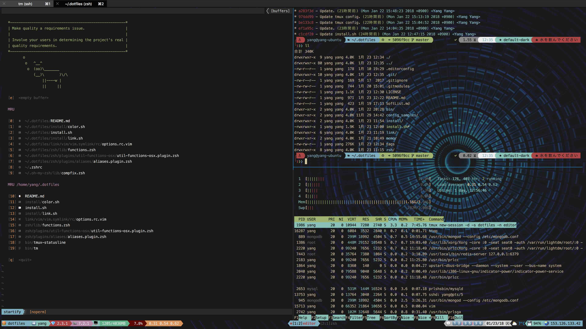

# DOTMAGIC

> Manage my dotfiles.

Basicly tested on OSX / Ubuntu, but some configuration like
(**vim**/**zsh**/**tmux**) should be able to migrate to other os distribution easily.

I use vim as my editor, zsh as my shell, and tmux as my terminal multiplexer.

## The Purpose

**Automate All The Things!**

When I am in a new machine, I'd like to build my enviroment from zero over just
copy from existed enviroment (which may cause a lot of wired problems).

## Install

Install is quite easy, just follow the steps below.

Via git
```sh
git clone https://github.com/kiooss/dotmagic.git ~/.dotfiles
bash ~/.dotfiles/bin/dotmagic
```

Via curl
```sh
curl -fsSL https://raw.github.com/kiooss/dotmagic/master/bin/dotmagic | bash
```

## Upgrade

You just need to run:
```sh
dotmagic
```

## Vim

Now on vim8 / neovim.

### Vim plugin manager
<!-- Vim plugins are managed with [vim-plug](https://github.com/junegunn/vim-plug). To install, run `vim +PlugInstall`. -->
Vim plugins are managed with the ⚡️ Dark powered Vim/Neovim plugin manager [dein.vim](https://github.com/Shougo/dein.vim).

## Zsh

My own config plus [oh-my-zsh](https://github.com/robbyrussell/oh-my-zsh).
Oh-my-zsh is optional, but it does a lot things for me and worked well, so I add it to my config.

<!-- Zsh plugins are managed with [zplug](https://github.com/zplug/zplug). -->
<!-- Install zplug with `curl -sL zplug.sh/installer | zsh` -->

## Tmux
Tmux is awesome, it saves me a lot of time since I decided to use it.

## Screenshot


## License

[MIT](license)
